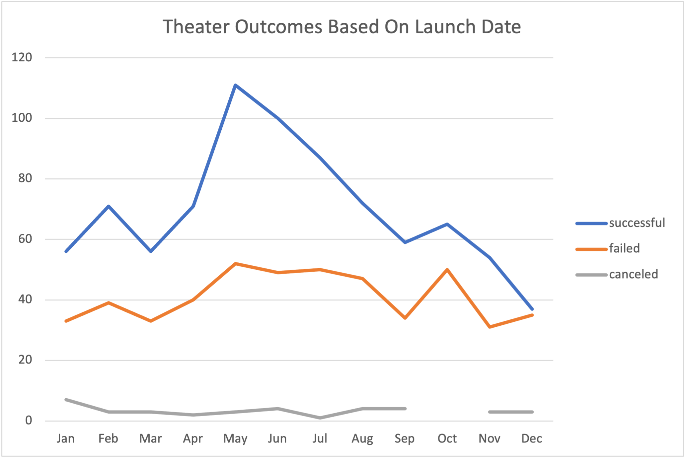

# Kickstarting with Excel

## Overview of Project
This project was to give Louise data on the outcomes of campaigns. The outcomes were based off of funding goals, launch dates, and if funding goals were met.
### Purpose
The purpose of this project was to give Louise data on the outcomes of campaigns categorized launch date and campaigns categorized by funding goals. This will help Louise know the outcomes of campaigns, as well as the best time of year to launch.
## Analysis and Challenges

### Analysis of Outcomes Based on Launch Date
In this section, I started by usting the YEARS function in a new column based on my Date Created Conversions column. This will be used later when making a pivot table. The pivot table is filtered by Category and by Years with the rows being Date Created Conversion. The columns is Outcomes while the Values is Count of Outcomes. I was able to filter the rows column to show months instead of years and I was able to make a chart showing my data.

### Analysis of Outcomes Based on Goals
In this section, I used COUNTIFS function to gather the totals of the plays campaigns. These totals included the Successful, Failed, and Canceled campaigns based off their funding goals. This was able to show which goal amount had a higher success rate and which amount had a higher fail rate.

### Challenges and Difficulties Encountered
A difficultie was getting the pivot table filtered correctly. I was having issues getting the months and not the years, as well as filtering to theaters was a bit of an issue. In the Outcomes Based on Goals, I had issues with coping the formulas to all my cells. This caused me set backs, but once I learned the formula, I was able to quickly enter it into my sheet.
## Results

- What are two conclusions you can draw about the Outcomes based on Launch Date?
Two conclusions based on Outcomes based on Launch Date is that in the summer months the campaigns had a better chance of being successful. May, June, and July wielded the highest number of successful campaigns.
The second conclusion is that December has nearly a 50/50 chance of fail or success which makes the month not so good for a campaign. Januray is also not a recommened launch date, even though it has the second lowest failed total, it has the highest total of canceled campaigns.
- What can you conclude about the Outcomes based on Goals?
I conclude that the plays campaigns with less than a 1000 goal were the most successful with a 75% success rate. I can also conclude that campaigns with a goal of 50000 or greater have an 87% chance of failing.
- What are some limitations of this dataset?
The limitations of this data set is that the there are not very many campaigns with a goal over 30000, so the conclusion could yield different results if we can gather more data on higher goal plays. 
- What are some other possible tables and/or graphs that we could create?
An interesting table that could be created is a pivot table comparing the number of backers for any given category to be able to see which campaigns yeild the most backing.